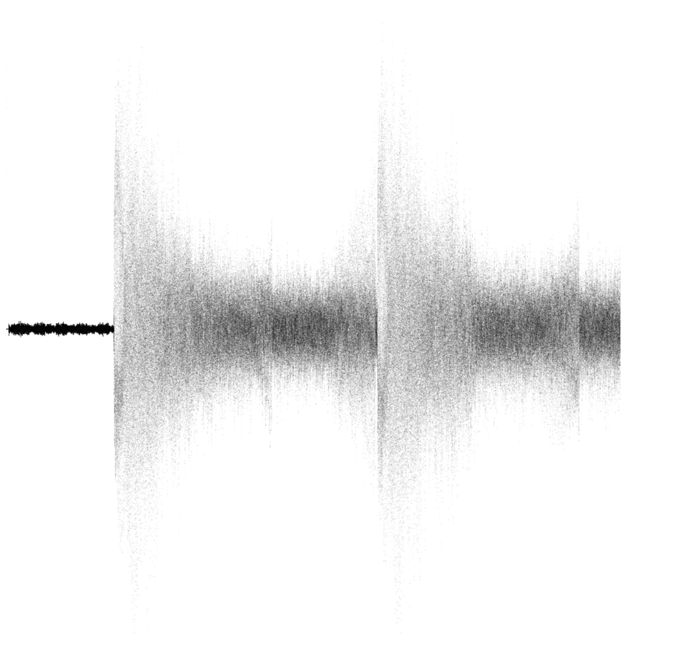

```bash
$ xxd example.wav | head -10
00000000: 5249 4646 2400 0080 5741 5645 666d 7420  RIFF$...WAVEfmt 
00000010: 1000 0000 0100 0100 d007 0000 a00f 0000  ................
00000020: 0100 1000 6461 7461 0000 0080 0000 4582  ....data......E.
00000030: e2d0 126c 9e57 c4b4 308c d41f be7f 0a10  ...l.W..0.......
00000040: 4586 57c2 9f62 9f62 57c2 4586 0a10 be7f  E.W..b.bW.E.....
00000050: d41f 308c c4b4 9e57 126c e2d0 4582 0000  ..0....W.l..E...
00000060: bb7d 1e2f ee93 62a8 3c4b d073 2ce0 4280  .}./..b.<K.s,.B.
00000070: f6ef bb79 a93d 619d 619d a93d bb79 f6ef  ...y.=a.a..=.y..
00000080: 4280 2ce0 d073 3c4b 62a8 ee93 1e2f bb7d  B.,..s<Kb..../.}
00000090: 0000 4582 e2d0 126c 9e57 c4b4 308c d41f  ..E....l.W..0...
```


